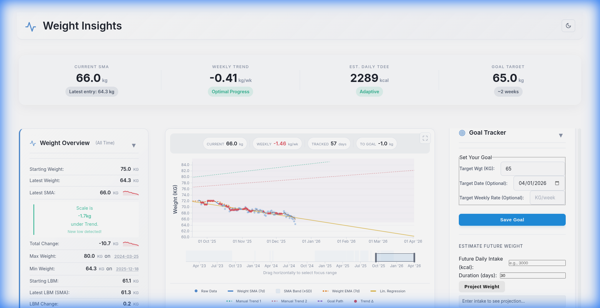

# Weight Insider

Weight Insider is a comprehensive body composition analysis tool that combines standard tracking with advanced predictive modeling.

> **Status:** Active Development (Phase 3 Complete)



*Zoomed view showing SMA/EMA trends and Goal Trajectory*

## 🚀 Quick Start

1.  **Run the application:**
    ```bash
    cd frontend
    npx live-server --port=8080
    ```
2.  **Open:** `http://localhost:8080`
3.  **Add your data** to `data.json` - see [User Guide](frontend/docs/user_guide.md#data-format)

---

## 💎 Features Showcase

### 📊 Deep Analysis Tools
Get a comprehensive view of your progress with the **Analytics Suite**. 
- **Monthly Reports:** detailed breakdowns of your monthly progress and trends, with automatic highlighting of best months.
- **Energy Balance:** Estimate of your daily intake vs expenditure.
- **Weekend vs. Weekday Analysis:** Identify if weekend habits are sabotaging your weekday efforts.


### 🧠 Smart Coaching & Energy Balance
Your personal AI coach.
- **Smart Coach:** Context-aware advice based on your current phase (Cut/Bulk).
- **Plateau Breaker:** Detects stalls and suggests actionable fixes.
- **Energy Balance:** Visualizes your Net Calories vs Weight Trend to find your true TDEE.


### 🎯 Goal Management
Stay accountable with a dedicated Goal Tracker.
- **Dynamic Projections:** Real-time estimates of when you will reach your target based on current adherence.
- **Adaptive Suggestions:** The Smart Engine analyzes your history to suggest realistic Cut/Bulk/Maintain plans.


### 🔥 Habit & Consistency Tracking
Building habits is key. The **Streak Tracker** gamifies your journey:
- **Active Streaks:** Track continuous logging and adherence streaks.
- **Water Weight Predictor:** Smart alerts for "Woosh Effects" and variance-based bloat detection help you separate water retention from fat loss.


### 🥑 Macro Impact
Understand how your nutrition affects your results.
- **Macro Split:** Visual breakdown of Protein/Carb/Fat distribution.
- **Correlation:** Statistical correlation between macro targets and weight volatility.


### ⚡ Metabolic Optimization
Fine-tune your strategy with the **Rate Optimizer** and **Reverse Diet Calculator**.
- **Rate Optimizer:** Visual gauge showing if you are losing/gaining too fast or too slow relative to optimal muscle-retention benchmarks.
- **Metabolic Adaptation:** Real-time tracking of how your TDEE adapts to your intake.


---

## 📚 Documentation

| Document | Audience | Description |
|----------|----------|-------------|
| [**User Guide**](frontend/docs/user_guide.md) | End Users | How to use all features, tips and best practices |
| [**Features Reference**](frontend/docs/features_reference.md) | Developers | Technical details, data structures, algorithms |
| [**Program Flow**](frontend/docs/program_flow.md) | Developers | Architecture diagrams, event flows, formulas |

---

## 🗂️ Project Structure

```
.
├── README.md               # 📍 You are here
├── assets/                 # Marketing Assets
└── frontend/               # Application Code
    ├── index.html
    ├── style.css
    ├── data.json
    ├── docs/               # Documentation
    └── js/
```

## ✅ Completed Features (v3.0)

- [x] **Smart Recommendations Engine** (Cut/Bulk detection)
- [x] **Metabolic Adaptation Tracker** (Rolling TDEE)
- [x] **Goal Simulator** (Projections with confidence bands)
- [x] **Data Health Dashboard** (Gap/Outlier detection)
- [x] **Water Weight Predictor** (Bloat detection)
- [x] **Rate Optimizer** (Sustainability benchmarks)
- [x] **Premium UI Polish** (Animations, Themes)
