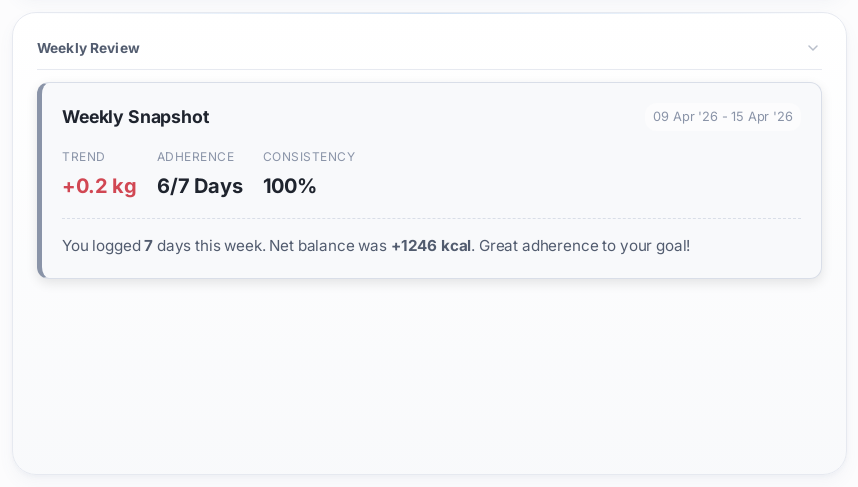
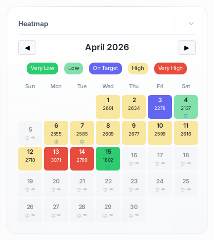
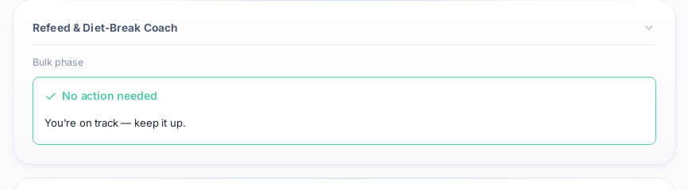

# Weight Insider

Weight Insider is a body-composition and weight-trend dashboard: interactive charts, macro and energy analytics, goal planning, and coaching-style widgets. The UI is a static **Vite** app under `frontend/` fed by `data.json` (from the Go exporters or hand-edited).

> **Status:** Active development (v4.1)  
> Screenshots below are captured from the current app (`npm run capture:readme-assets` after `npm run dev`).

  
*Executive hub: SMA, weekly rate, TDEE, and goal timeline.*

  
*Bento layout: hero weight, chart, stats, goals, and analytics cards.*

  
*Master chart: SMA / EMA, bands, regression, zoom and brush.*

---

## Quick Start

```bash
cd frontend
npm install
npm run dev          # Vite → http://localhost:8080 (see vite.config.js)
```

Production build and local preview:

```bash
npm run build        # output: frontend/dist/
npm run preview      # serves the build (default port from Vite)
```

---

## Features (high level)

### Dashboard

- Collapsible bento widgets, dashboard presets, mobile FAB navigation  
- Themes: **Light**, **Dark**, **Gruvbox** (header toggle; same choice in **Settings**)  
- **Settings** (gear): units, date format, week start, SMA/EMA/volatility windows, motion, data export/import/reset  
- **Daily calorie budget** chip and **toasts** for saves and system messages  

### Chart and analysis

- Master weight chart with SMA area fill, EMA, regression, goal overlay, tooltips, zoom, context brush  
- Analysis range presets, manual trendlines, annotations  
- Energy balance, Sankey, TDEE accuracy, correlations, scatter plot, weekly review, calorie heatmap, refeed coach, and more  

### Goals, macros, coaching

- Inline goal form, goal simulator, alerts and suggestions  
- Macro summary, protein adequacy, rolling macro averages  
- Smart Coach, plateau breaker, refeed & diet-break coach, rate optimizer, and other sidebar-style analytics (see `frontend/docs/`)

---

## Screenshots

### Weekly review

  
*Weekly review card (monthly report renderer is not mounted in the default `index.html`; regenerate assets if you add that container).*

### Advanced analytics (correlation matrix)

  
*Multi-variable correlation heatmap.*

### Goal simulator


### Macros

  


### Quick entry

  
*Manual weight / calories: stored in `localStorage` and merged at load time.*

### Calorie heatmap

  
*Calendar-style intake view (replaces legacy streak-tracker screenshot for the default layout).*

### Refeed coach



---

## Regenerating screenshots

Requires a running dev server and Playwright (devDependency in `frontend/`).

```bash
cd frontend
npm install
npm run dev          # terminal 1 — http://127.0.0.1:8080
npm run capture:readme-assets   # terminal 2 — writes PNGs into ../assets/
```

Override base URL: `CAPTURE_BASE_URL=http://127.0.0.1:4173 npm run capture:readme-assets` (e.g. after `npm run preview`).

---

## PWA / offline

The service worker (`frontend/public/sw.js`) uses **cache-first** static assets and **network-first** `data.json`, with messaging when offline or when new data is available.

---

## Data format

Primary file: `frontend/data.json`. Shape (simplified):

```jsonc
{
  "weights":        { "YYYY-MM-DD": kg },
  "calorieIntake":  { "YYYY-MM-DD": kcal },
  "expenditure":    { "YYYY-MM-DD": kcal },
  "macroProtein":   { "YYYY-MM-DD": grams },
  "macroCarbs":     { "YYYY-MM-DD": grams },
  "macroFat":       { "YYYY-MM-DD": grams },
  "macroFiber":     { "YYYY-MM-DD": grams }
}
```

Macro keys may also appear as bare `protein` / `carbs` / `fat` / `fiber` for older exports. Goals and annotations are often kept in **localStorage**; use **Settings → Data** to export everything.

---

## Documentation

| Document | Audience | Description |
| -------- | -------- | ----------- |
| [User Guide](frontend/docs/user_guide.md) | Users | How to use the app |
| [Features Reference](frontend/docs/features_reference.md) | Developers | Modules, state, algorithms |
| [Program Flow](frontend/docs/program_flow.md) | Developers | Startup and event diagrams |

Root [`docs/program_flow.md`](docs/program_flow.md) points at the same diagrams for older links.

---

## Repository layout

```
.
├── README.md
├── assets/                 # README screenshots (regenerate with capture:readme-assets)
├── docs/                   # Pointer / extras (canonical flow doc is under frontend/docs/)
├── backend/                # Go exporters
└── frontend/               # Vite app (see frontend/docs/README.md for file tree)
```

---

## Release notes (abbreviated)

### v4.1

- Settings panel, calorie budget chip, toast stack, refeed coach, chart visual polish, `icons.js`, expanded design tokens  

### v4.0

- Macro widgets, quick entry, CSV export, Gruvbox theme, widget collapse, mobile nav, PWA caching, lazy renderers, ESLint + Prettier, CSS split  

### v3.0 and earlier

- Smart coaching stack, metabolic adaptation, goal simulator, correlation matrix, premium UI polish — see `frontend/docs/features_reference.md` for the full list.
