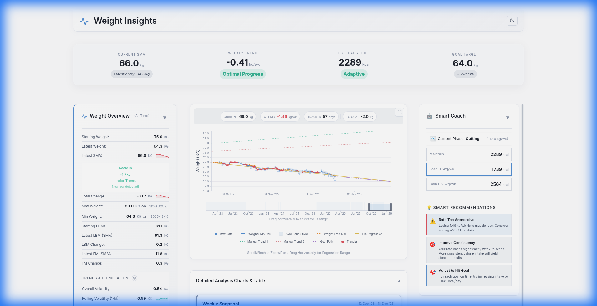
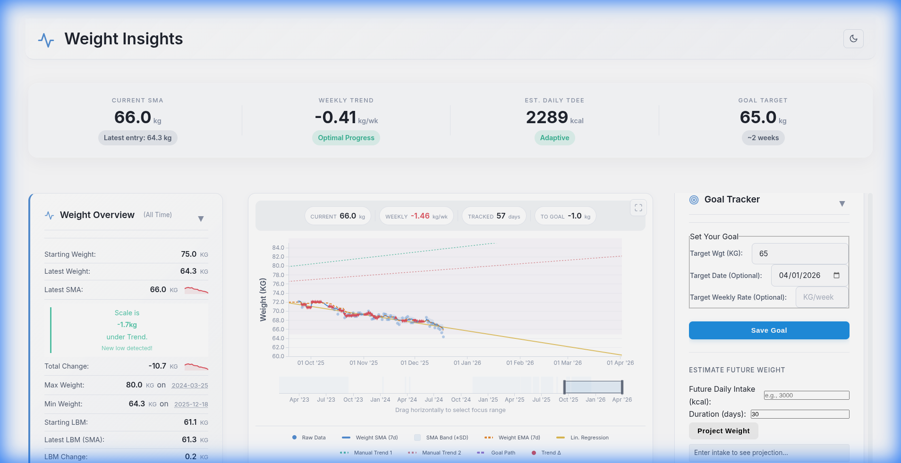
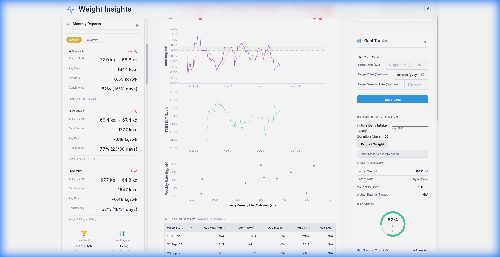
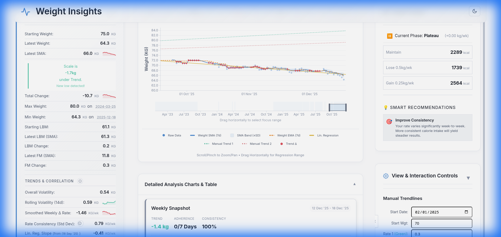
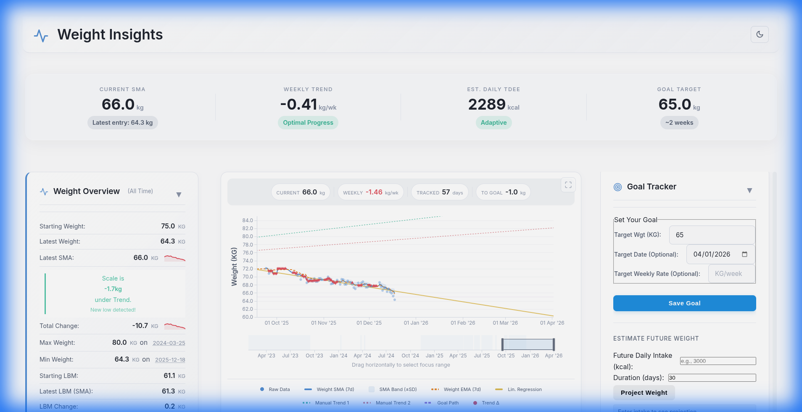
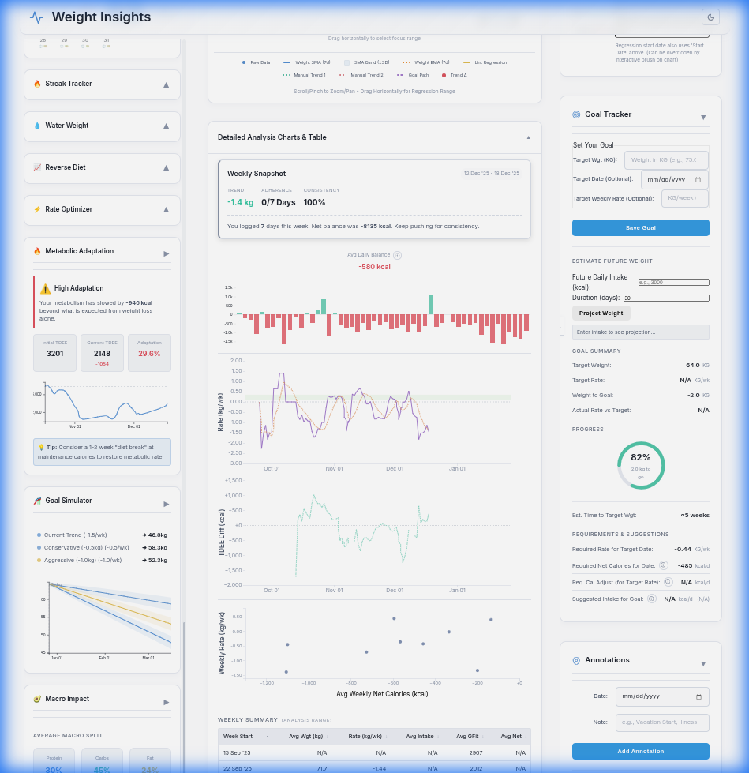

# Weight Insider

Weight Insider is a comprehensive body composition analysis tool that combines standard weight tracking with advanced predictive modelling, macro nutrition analysis, and AI-assisted coaching.

> **Status:** Active Development (v4.0)


*At-a-glance summary: current SMA, weekly trend, estimated TDEE, and goal timeline*



*Zoomed view showing SMA/EMA trends and Goal Trajectory*

---

## Quick Start

```bash
cd frontend
npm install
npm run dev          # Vite dev server → http://localhost:5173
```

For a production build:

```bash
npm run build        # outputs to frontend/dist/
```

To serve the build locally:

```bash
npm run preview
```

---

## Features

### Executive Hub
The top-of-page hub card shows the four most critical metrics at a glance: current smoothed weight (SMA), weekly rate of change, estimated daily TDEE, and time-to-goal.

### Deep Analysis Tools

**Monthly Reports** — detailed breakdowns with automatic highlighting of best/worst months.  
**Energy Balance** — daily intake vs. expenditure with goal-aware colouring (green = on-track, red = off-track relative to your current cut/bulk phase).  
**Weekend vs Weekday Analysis** — detect whether weekend habits are undermining weekday effort.



### Smart Coaching & Energy Balance

**Smart Coach** — context-aware advice based on your current phase (Cut/Bulk/Maintain).  
**Plateau Breaker** — detects stalls and suggests actionable fixes.  
**Energy Balance Sankey** — visualises your Net Calories vs Weight Trend to find your true TDEE.



### Goal Management

**Dynamic Projections** — real-time estimates of target date based on current adherence.  
**Adaptive Suggestions** — the engine analyses your history and proposes realistic Cut/Bulk/Maintain plans.



### Macro Nutrition

**Macro Breakdown** — latest-day protein, carbs, fat, and fiber as progress bars (grams + % of calories), plus a 7-day average calorie split.


**Protein Adequacy** — prominent `g/kg` bodyweight readout colour-coded as Optimal / Sufficient / Low, a threshold-marker progress bar, and a 14-day sparkline of `g/kg` trends.


**Macro Rolling Averages** — 7-day and 14-day rolling averages for each macro with delta indicators inside the Rolling Averages widget.

### Quick Entry

Log weight and calories directly from the dashboard without touching `data.json`. Entries are stored in `localStorage` and overlaid on the fetched data at runtime.


### Habit & Consistency Tracking

**Streak Tracker** — tracks continuous logging and adherence streaks.  
**Water Weight Predictor** — smart alerts for "Woosh Effects" and variance-based bloat detection.



### Metabolic Optimisation

**Rate Optimizer** — visual gauge for loss/gain rate vs optimal muscle-retention benchmarks.  
**Metabolic Adaptation** — real-time tracking of how your TDEE adapts to your intake.  
**Reverse Diet Calculator** — plans a structured calorie ramp-up after a cut.

---

## PWA / Offline Support

Weight Insider ships a Service Worker (`public/sw.js`) that:

- **Cache-first** strategy for all static assets (HTML, JS, CSS, fonts, icons) — loads instantly on repeat visits and updates in the background.
- **Network-first** strategy for `data.json` — always tries to fetch fresh data; serves the cached copy when offline and shows an in-app toast.
- Shows a "New data available — reload to apply" notification when data changes while the app is open.

---

## Data Format

Data lives in `frontend/data.json`. The file is generated by the backend exporters but can be edited manually or augmented with the Quick Entry widget.

```jsonc
{
  "weights":        { "YYYY-MM-DD": kg },
  "calorieIntake":  { "YYYY-MM-DD": kcal },
  "expenditure":    { "YYYY-MM-DD": kcal },     // optional Google Fit TDEE
  "macroProtein":   { "YYYY-MM-DD": grams },    // optional
  "macroCarbs":     { "YYYY-MM-DD": grams },    // optional
  "macroFat":       { "YYYY-MM-DD": grams },    // optional
  "macroFiber":     { "YYYY-MM-DD": grams },    // optional
  "goal": { "weight": kg, "startWeight": kg, "targetRate": kg_per_week }
}
```

Macro keys support both the `macro*` prefix form (generated by the backend) and legacy bare keys (`protein`, `carbs`, `fat`, `fiber`).

---

## Documentation

| Document | Audience | Description |
|----------|----------|-------------|
| [**User Guide**](frontend/docs/user_guide.md) | End Users | How to use all features, tips and best practices |
| [**Features Reference**](frontend/docs/features_reference.md) | Developers | Technical details, data structures, algorithms |
| [**Program Flow**](frontend/docs/program_flow.md) | Developers | Architecture diagrams, event flows, formulas |

---

## Project Structure

```
.
├── README.md
├── assets/                         # Screenshots and marketing assets
├── backend/                        # Go exporters (data_exporter.go, health_connect_data_exporter.go)
└── frontend/                       # Application code
    ├── index.html
    ├── vite.config.js
    ├── eslint.config.js
    ├── .prettierrc.json
    ├── data.json                   # Primary data source
    ├── public/
    │   ├── sw.js                   # Service Worker (PWA)
    │   └── manifest.json
    ├── css/
    │   ├── variables.css           # Design tokens & theming
    │   ├── layout.css
    │   ├── components.css
    │   └── widgets/                # Per-feature widget styles
    │       ├── base.css
    │       ├── components.css
    │       ├── dashboards.css
    │       ├── periodization-analytics.css
    │       └── advanced-features.css
    ├── js/
    │   ├── main.js                 # Entry point & lazy renderer init
    │   ├── config.js
    │   ├── core/
    │   │   ├── stateManager.js     # Redux-style state bus
    │   │   ├── dataService.js      # Fetch, merge & process pipeline
    │   │   ├── statsManager.js     # Derived statistics (incl. macros)
    │   │   ├── manualEntryService.js  # localStorage manual entries
    │   │   ├── goalManager.js
    │   │   └── utils.js
    │   ├── ui/
    │   │   ├── renderers/          # 35 bento-widget renderers
    │   │   ├── widgetCollapser.js  # Collapse/expand all widgets
    │   │   ├── mobileNav.js        # Mobile FAB navigation
    │   │   ├── manualEntryWidget.js
    │   │   └── dataTableModal.js   # Full data table + CSV export
    │   └── interactions/           # Chart interactions & event handlers
    ├── docs/                       # Extended documentation
    └── tests/                      # Unit tests
```

---

## Completed Features

### v4.0 (latest)
- [x] **Macro Nutrition Tracking** (Protein/Carbs/Fat/Fiber breakdown, g/kg, rolling averages)
- [x] **Protein Adequacy Widget** (g/kg readout, sparkline, threshold markers)
- [x] **Quick Entry Widget** (manual weight + calorie logging via localStorage)
- [x] **CSV Export** (download full processed dataset from the data table modal)
- [x] **Widget Collapse / Expand** (per-widget, persisted in localStorage)
- [x] **Mobile Navigation FAB** (anchor-link panel for all bento widgets on small screens)
- [x] **Proper PWA Caching** (cache-first static assets, network-first data, offline toast)
- [x] **Goal-aware Energy Balance Colours** (green/red based on cut vs. bulk direction)
- [x] **Lazy Renderer Initialisation** (IntersectionObserver defers off-screen widgets)
- [x] **StateManager Performance** (shallow clone in reducer, no defensive deep clones in dispatch)
- [x] **All Renderers Migrated to Typed Events** (subscribeToSpecificEvent replaces fragile string-match subscribe)
- [x] **CSS Split** (monolithic widgets.css → 5 thematic modules)
- [x] **ESLint + Prettier** (lint/lint:fix/format scripts added)

### v3.0
- [x] **Smart Recommendations Engine** (Cut/Bulk detection)
- [x] **Metabolic Adaptation Tracker** (Rolling TDEE)
- [x] **Goal Simulator** (Projections with confidence bands)
- [x] **Data Health Dashboard** (Gap/Outlier detection)
- [x] **Water Weight Predictor** (Bloat detection)
- [x] **Rate Optimizer** (Sustainability benchmarks)
- [x] **Premium UI Polish** (Animations, Themes)
