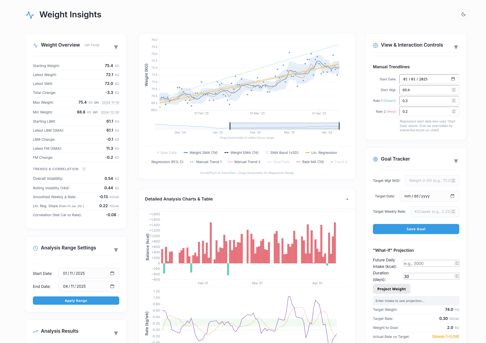

# weight-insider

TODO:
1. Understand how `plateau detection` is designed, and fix it.
2. Learn D3 and how it is used in this project.
3. Make raw data toggable.
4. Fix sorting entries in weekly summary

Ideas:
1. Maybe EventHandlers should explicitly subscribe to state changes.
