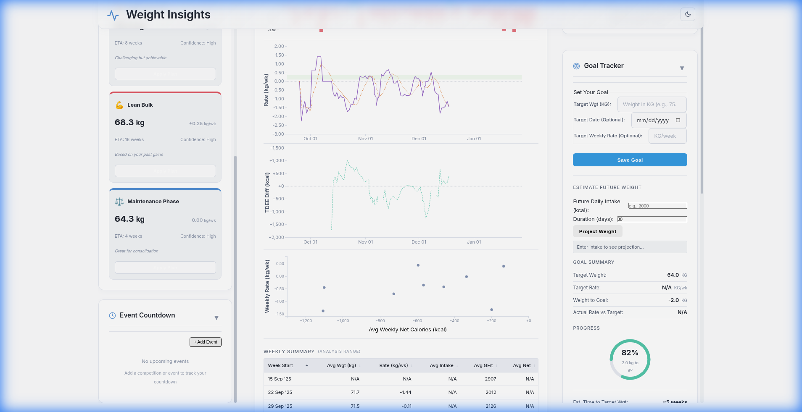
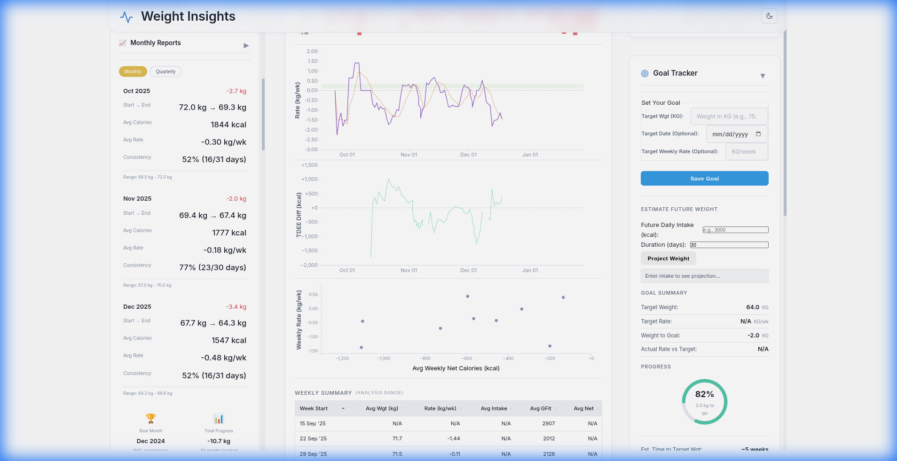
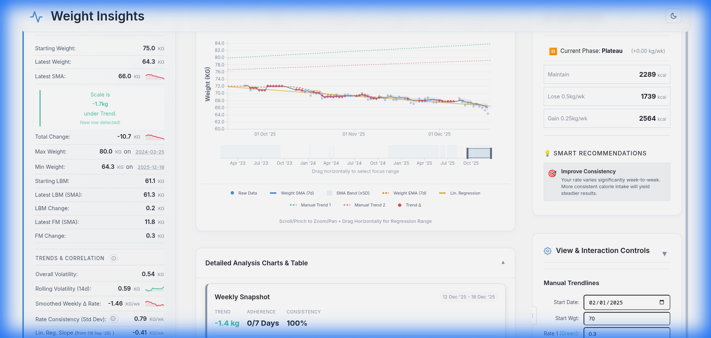
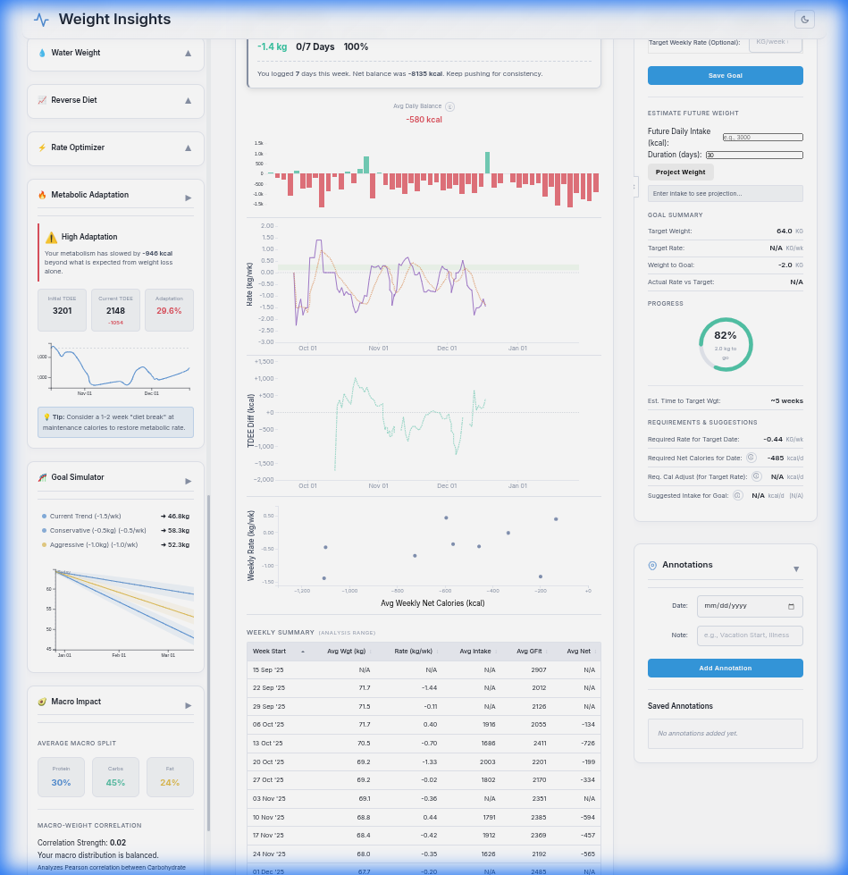
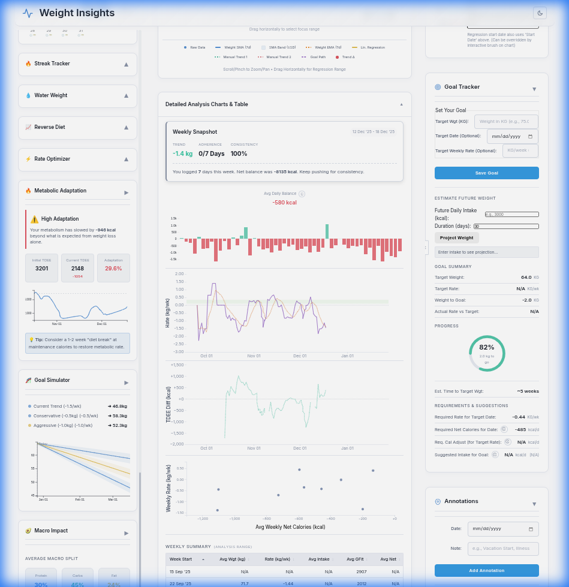
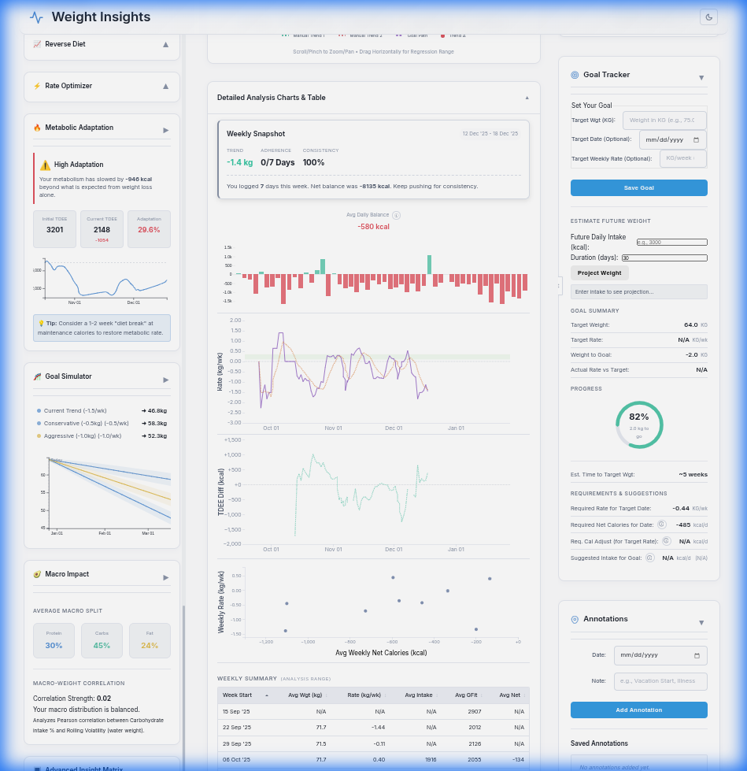
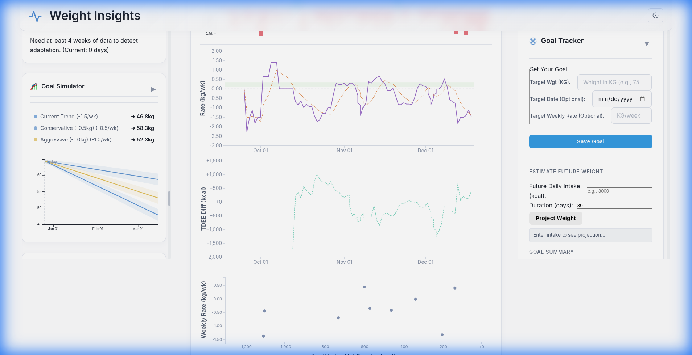

# Weight Insider - Project Showcase

Weight Insider is a comprehensive body composition analysis tool that combines standard tracking with advanced predictive modeling.

## 核心 Core Features

### 📈 Interactive Weight Dashboard
A professional-grade chart interface to visualize your journey.
- **Trend Analysis:** See through daily fluctuations with SMA (Simple Moving Average) and EMA (Exponential Moving Average) trend lines.
- **Goal Visualization:** Visualize your path to success with dynamic goal vectors.
- **Data Precision:** Interactive tooltips and zoom capabilities for granular data inspection.

### 🎯 Goal Management
Stay accountable with a dedicated Goal Tracker.
- **Dynamic Projections:** Real-time estimates of when you will reach your target based on current adherence.
- **Progress Tracking:** Visual progress rings to keep you motivated.
- **Goal Simulator:** (See below) Interactive tool to project future weight based on hypothetical intake changes.

---

## 💎 Premium Analytics Suite

### 🧠 Adaptive Intelligence
Stop guessing your targets. The **Smart Goal Engine** analyzes your historical adherence, sustainable weekly rates, and recent trends to suggest realistic plans.
- **Bulk, Cut, or Maintain:** Tailored suggestions for every phase of your journey.
- **Confidence Scores:** Know how likely you are to succeed based on past data.

### 📊 Deep Analysis Tools
Get a comprehensive view of your progress with the **Analytics Suite**. 
- **Monthly Reports:** detailed breakdowns of your monthly progress and trends, with automatic highlighting of best months.
- **Energy Balance:** (Shown below on right) Estimate of your daily intake vs expenditure.
- **Weekend vs. Weekday Analysis:** Identify if weekend habits are sabotaging your weekday efforts.

### 🧠 Smart Coaching & Energy Balance
Your personal AI coach.
- **Smart Coach:** (Right sidebar) Context-aware advice based on your current phase (Cut/Bulk).
- **Plateau Breaker:** Detects stalls and suggests actionable fixes.
- **Energy Balance:** Visualizes your Net Calories vs Weight Trend to find your true TDEE.

### 🥑 Macro Impact
Understand how your nutrition affects your results.
- **Macro Split:** Visual breakdown of Protein/Carb/Fat distribution.
- **Correlation:** Statistical correlation between macro targets and weight volatility.

### 🔥 Habit & Consistency Tracking
Building habits is key. The **Streak Tracker** gamifies your journey:
- **Active Streaks:** Track continuous logging and adherence streaks.
- **Personal Bests:** Celebrate your longest periods of consistency.
- **Water Weight Predictor:** Smart alerts for "Woosh Effects" and variance-based bloat detection help you separate water retention from fat loss.

### ⚡ metabolic Optimization
Fine-tune your strategy with the **Rate Optimizer** and **Reverse Diet Calculator**.
- **Rate Optimizer:** Visual gauge showing if you are losing/gaining too fast or too slow relative to optimal muscle-retention benchmarks.
- **Reverse Dieting:** Step-by-step calorie increase schedules to restore your metabolism after a diet phase without regaining fat.
- **Metabolic Adaptation:** Real-time tracking of how your TDEE adapts to your intake.

### 🤖 Smart Coach
Personalized, context-aware advice to keep you on track.
- **Phase Detection:** Automatically highlights if you are cutting, bulking, or maintaining.
- **Actionable Tips:** Specific advice to break plateaus or improve consistency.

---

## 🚀 Getting Started
Check the `docs/user_guide.md` for detailed instructions on how to leverage these features.
