# Application Flow Diagrams

This document contains diagrams illustrating the key flows within the weight tracking application.

> **📚 Related Documentation:**
> - [User Guide](user_guide.md) - How to use all features
> - [Features Reference](features_reference.md) - Technical details of all features
> - [Documentation Index](README.md) - Overview of all documentation

## 1. Application Startup Flow

This diagram shows the main steps involved when the application loads initially.

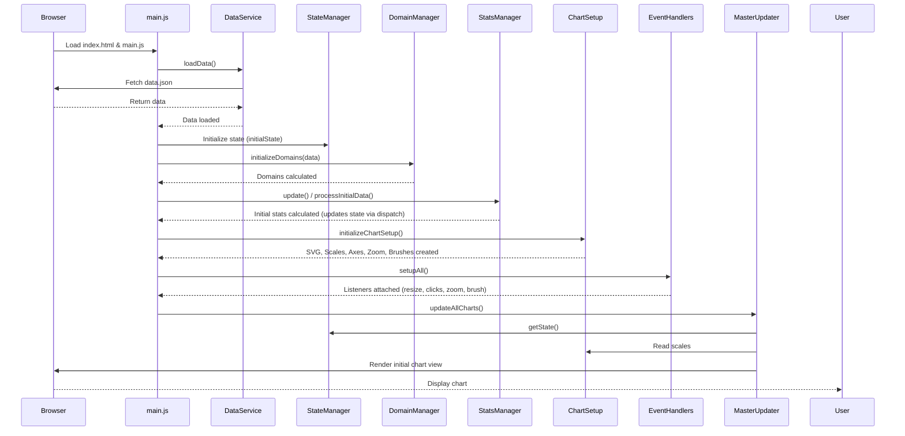

**Explanation:**

1.  The browser loads the HTML and the main JavaScript file (`main.js`).
2.  `main.js` initiates data loading via `DataService`.
3.  Once data is available, core managers like `StateManager`, `DomainManager`, and `StatsManager` are initialized, setting up the initial application state, calculating data ranges, and computing initial statistics.
4.  `ChartSetup` creates all the necessary visual components (SVG structure, scales, axes, interaction elements like zoom/brush).
5.  `EventHandlers` attaches listeners to the window, UI controls, and chart elements.
6.  Finally, `MasterUpdater` performs the initial rendering of all chart components based on the prepared state and scales.

## 2. Event Handling Flows

This section illustrates how the application responds to specific user interactions.

### 2.1 Dot Hover/Click Interaction

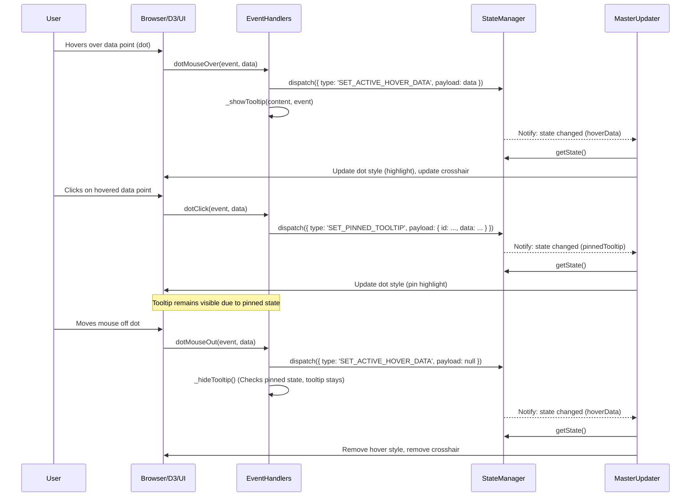
*   **Explanation:** Shows how hovering triggers tooltip display and state updates for highlighting. Clicking toggles the pinned state for the tooltip and associated data point.

### 2.2 Date Range Input Change

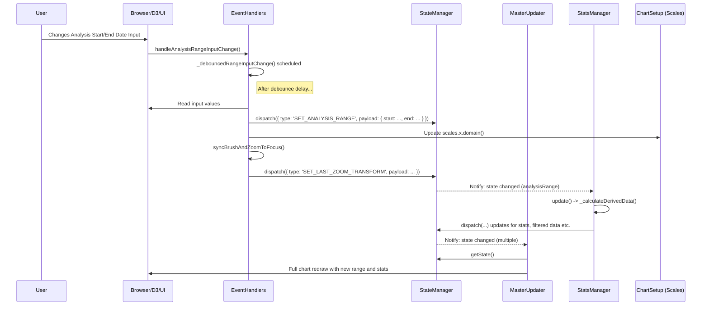
*   **Explanation:** Illustrates how changing the date inputs triggers a debounced update, leading to a state change for the analysis range, recalculation of stats by `StatsManager`, and a full chart redraw by `MasterUpdater`.

### 2.3 Background Click

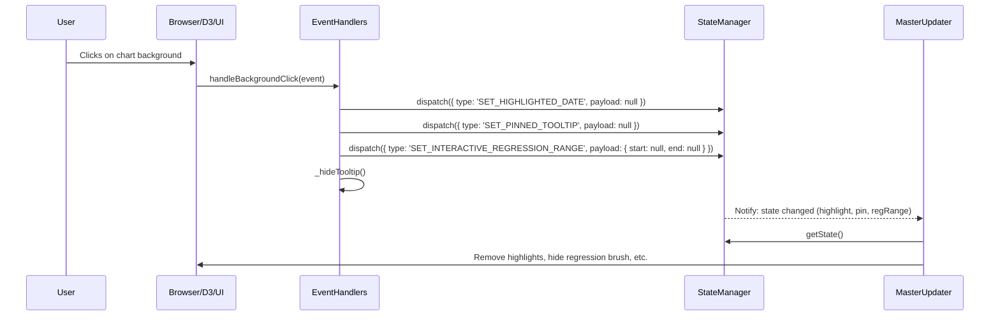
*   **Explanation:** Demonstrates how clicking the background clears transient states like highlights, pinned tooltips, and the interactive regression range by dispatching null payloads to the `StateManager`.

### 2.4 Window Resize

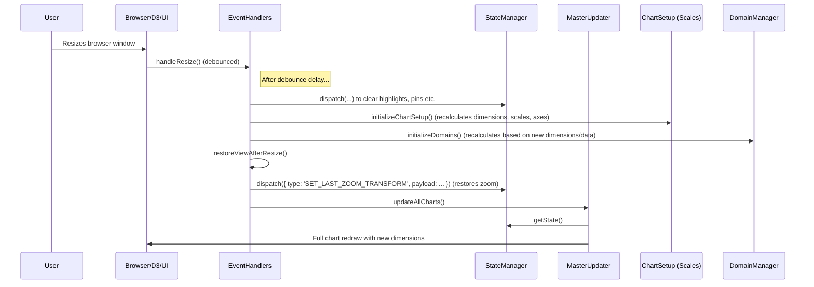
*   **Explanation:** Shows the debounced handling of resize events, which involves re-initializing the chart setup, recalculating domains, restoring the previous zoom/brush state, and triggering a full redraw.

### 2.5 Goal Form Submission

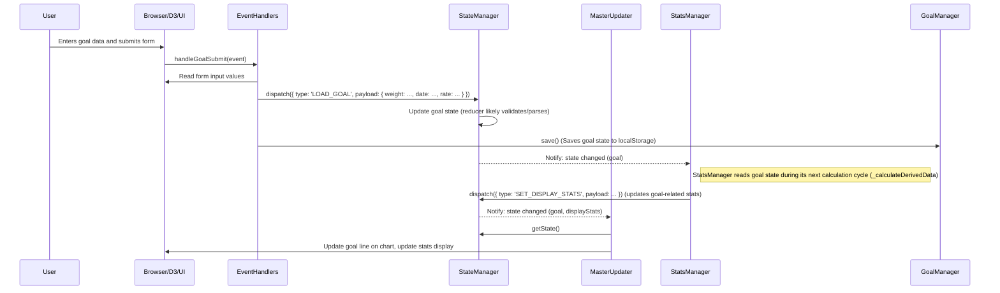
*   **Explanation:** Details how submitting the goal form dispatches an action to update the goal state, triggers a save to local storage, and eventually leads to updates in the stats display and chart visuals.

### 2.6 Theme Toggle

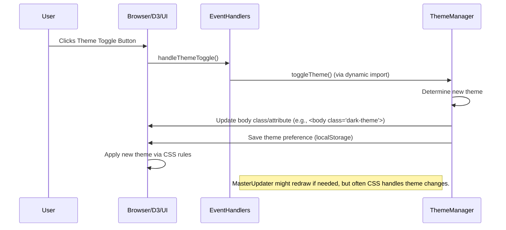
*   **Explanation:** Explains how clicking the toggle button calls the `ThemeManager`, which updates the UI (likely via CSS classes) and saves the preference, usually without complex state dispatches.

### 2.7 Annotation Form Submission

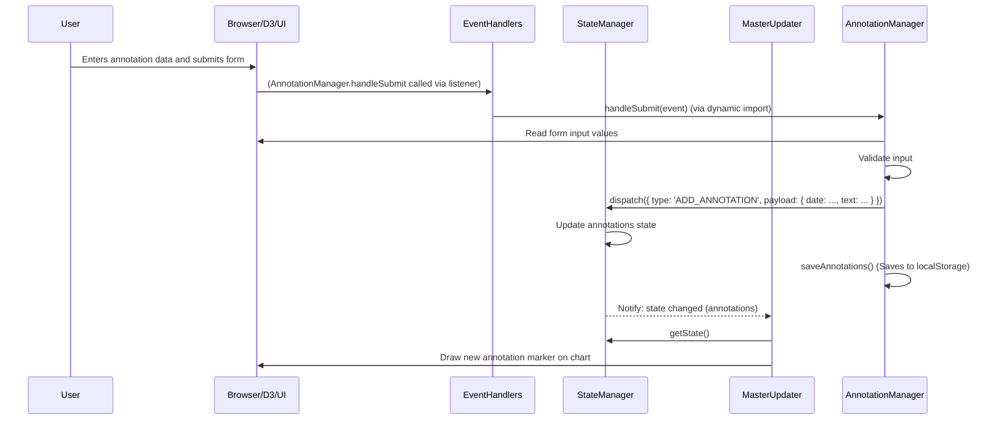
*   **Explanation:** Shows how submitting the annotation form triggers the `AnnotationManager` to validate, dispatch an `ADD_ANNOTATION` action, save the data, and update the chart display.

### 2.8 Manual Trendline Input Change

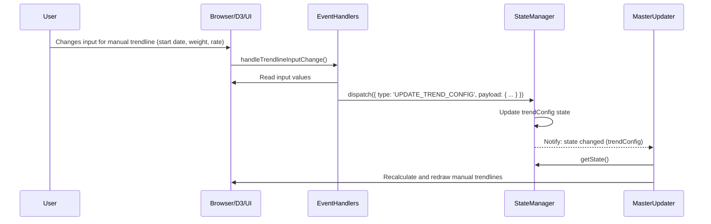
*   **Explanation:** Illustrates how modifying trendline inputs dispatches an `UPDATE_TREND_CONFIG` action, causing the `MasterUpdater` to redraw the manual trendlines.

### 2.9 Stat Date Click (from Stats Panel)

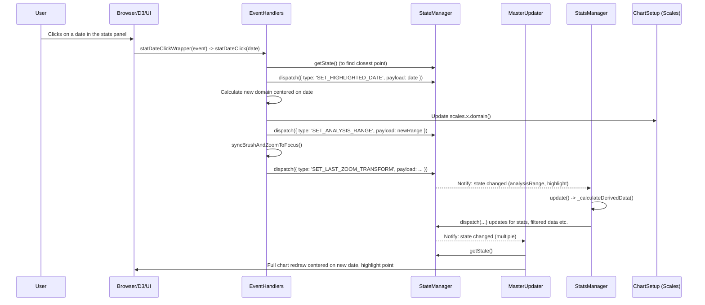
*   **Explanation:** Explains how clicking a date in the statistics panel triggers centering the chart view on that date, updating the analysis range, highlighting the point, and recalculating/redrawing relevant data.

### 2.10 Regression Brush Set/Drag

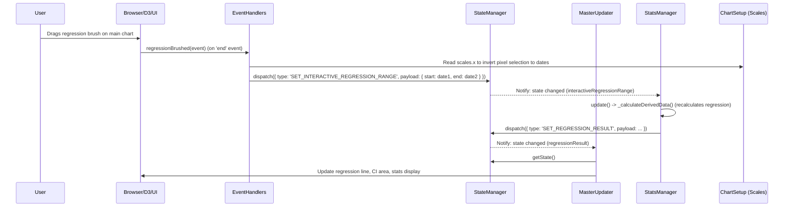
*   **Explanation:** Details how finishing a drag action with the regression brush dispatches the new date range to the state, triggering recalculation of regression statistics and visual updates to the regression line and confidence interval.

### 2.11 Legend Item Click

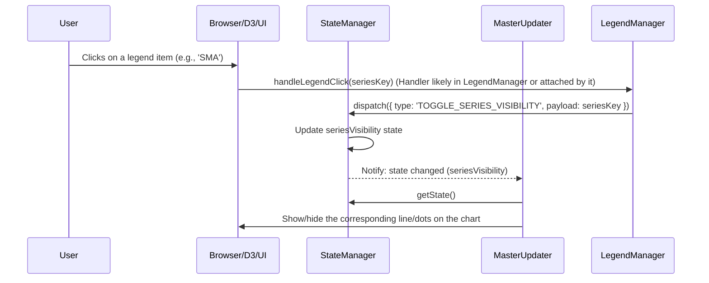
*   **Explanation:** Shows how clicking a legend item likely triggers a state change to toggle the visibility of the corresponding data series, followed by a visual update from `MasterUpdater`.

### 2.12 Annotation List Item Click

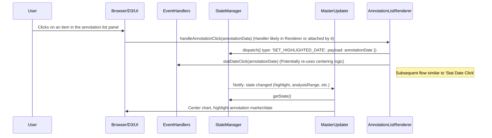
*   **Explanation:** Illustrates how clicking an annotation in the list panel might highlight the corresponding date and potentially center the chart view on it, reusing logic similar to the 'Stat Date Click'.

### 2.13 "What If" Scenario Submission

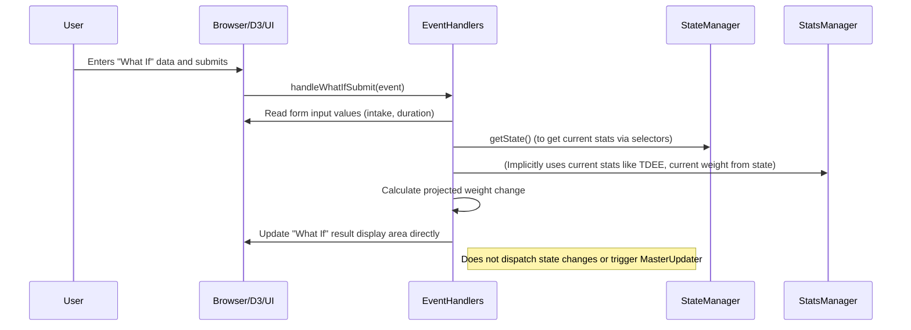
*   **Explanation:** Shows how submitting the "What If" form reads current state/stats, performs a calculation, and directly updates the result display area without altering the main chart state or triggering major redraws.

## 3. Key Formulas and Calculations

This section outlines the primary formulas used within `StatsManager` to derive key metrics. `KCALS_PER_KG` is a configuration constant (typically ~7700).

**TDEE Estimation (from Weight Trend)**

*   Calculates Total Daily Energy Expenditure based on average intake and the rate of weight change.
*   `Daily KG Change = Weekly KG Change / 7`
*   `Daily Deficit/Surplus (kcal) = Daily KG Change * KCALS_PER_KG`
*   `TDEE (kcal) = Average Calorie Intake - Daily Deficit/Surplus`

**Estimated Deficit/Surplus (from Trend)**

*   Estimates the average daily calorie balance based solely on the rate of weight change.
*   `Daily KG Change = Weekly KG Change / 7`
*   `Estimated Daily Deficit/Surplus (kcal) = Daily KG Change * KCALS_PER_KG`

**Time to Goal Projection**

*   Estimates the time required to reach the goal weight based on the current trend.
*   `Weight Difference (kg) = Goal Weight - Current Weight`
*   `Weeks Needed = Weight Difference / Weekly KG Change`
*   *(Result is formatted into days/weeks/months/years)*

**Required Rate for Goal Date**

*   Calculates the weekly rate needed to reach the goal weight by the target date.
*   `Weight Difference (kg) = Goal Weight - Current Weight`
*   `Days Remaining = (Goal Date - Today) / Milliseconds_Per_Day`
*   `Required Weekly Rate (kg/wk) = Weight Difference / (Days Remaining / 7)`

**Required Calorie Adjustment (for Target Rate)**

*   Calculates the change in daily net calories needed to match the user's target rate.
*   `Rate Difference (kg/wk) = Target Rate - Current Trend Rate`
*   `Required Daily Adjustment (kcal) = (Rate Difference / 7) * KCALS_PER_KG`

**Required Net Calories (for Goal Date)**

*   Calculates the required average daily net calorie balance to meet the goal by the target date.
*   `Required Daily Deficit/Surplus (kcal) = (Required Weekly Rate / 7) * KCALS_PER_KG`
*   `Required Net Calories = Required Daily Deficit/Surplus`

**Suggested Intake Range**

*   Provides a suggested daily calorie intake range to meet the goal date.
*   `Baseline TDEE = Adaptive TDEE or Trend TDEE or Google Fit TDEE` (Uses best available estimate)
*   `Target Intake = Baseline TDEE + Required Daily Deficit/Surplus`
*   `Range = [Target Intake - 100, Target Intake + 100]`

**Linear Regression**

*   Uses the `simple-statistics` library (`ss.linearRegression`) to find the line of best fit for weight (or SMA) data over time within the selected regression range.
*   The slope (`m`) represents the average *daily* weight change (kg/day) during that period.

**Volatility**

*   Calculates the standard deviation (`ss.standardDeviation`) of the difference between daily raw weight values and their corresponding Simple Moving Average (SMA) value within the analysis range. Measures day-to-day weight fluctuations around the trend.

**Plateau Detection**

*   Identifies periods where the `smoothedWeeklyRate` remains close to zero (within `CONFIG.plateauRateThresholdKgWeek`) for a minimum duration (`CONFIG.plateauMinDurationWeeks`).

**Trend Change Detection**

*   Compares the slope of the SMA line (calculated over `CONFIG.trendChangeWindowDays`) before and after each data point.
*   If the absolute difference between the 'before' slope and 'after' slope exceeds `CONFIG.trendChangeMinSlopeDiffKgWeek`, a significant change in trend direction or speed is marked.

---

## 4. New Analysis Features Flows

This section documents the flows for features added in version 2.0.

### 4.1 Periodization Analysis Flow

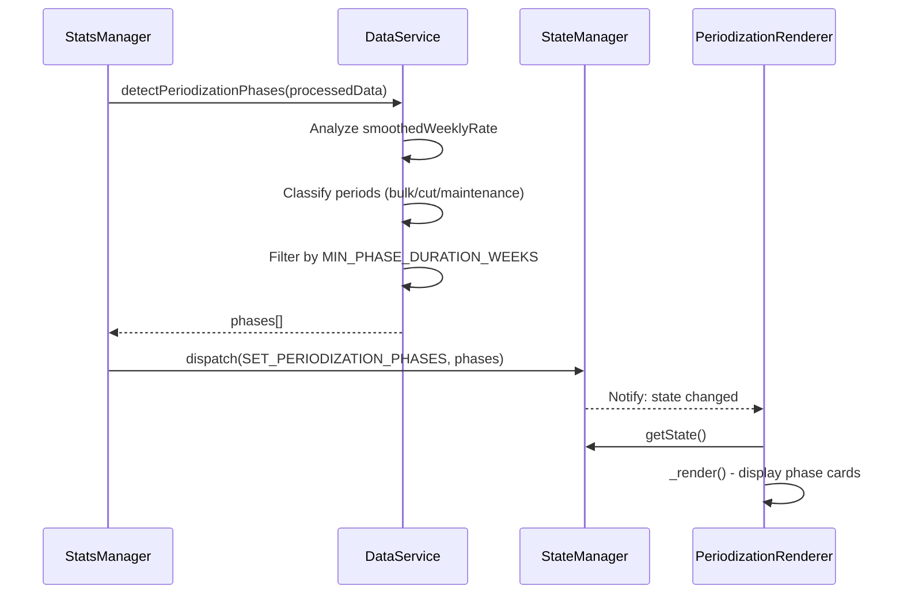

**Explanation:** During the stats update cycle, `DataService` analyzes weight rate data to detect training phases. Results are dispatched to state and rendered by the dedicated component.

### 4.2 Workout Correlation Flow

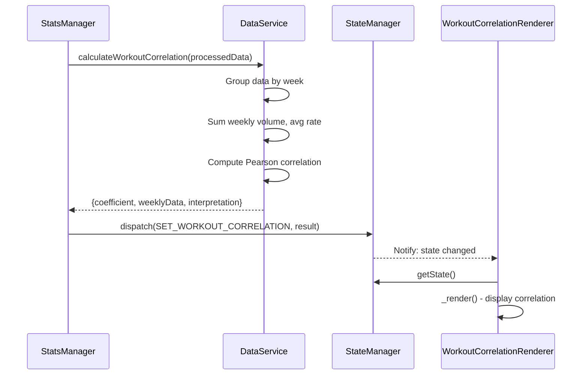

**Explanation:** Correlation between training volume and weight change is calculated weekly, with statistical interpretation provided.

### 4.3 Period Comparison Flow

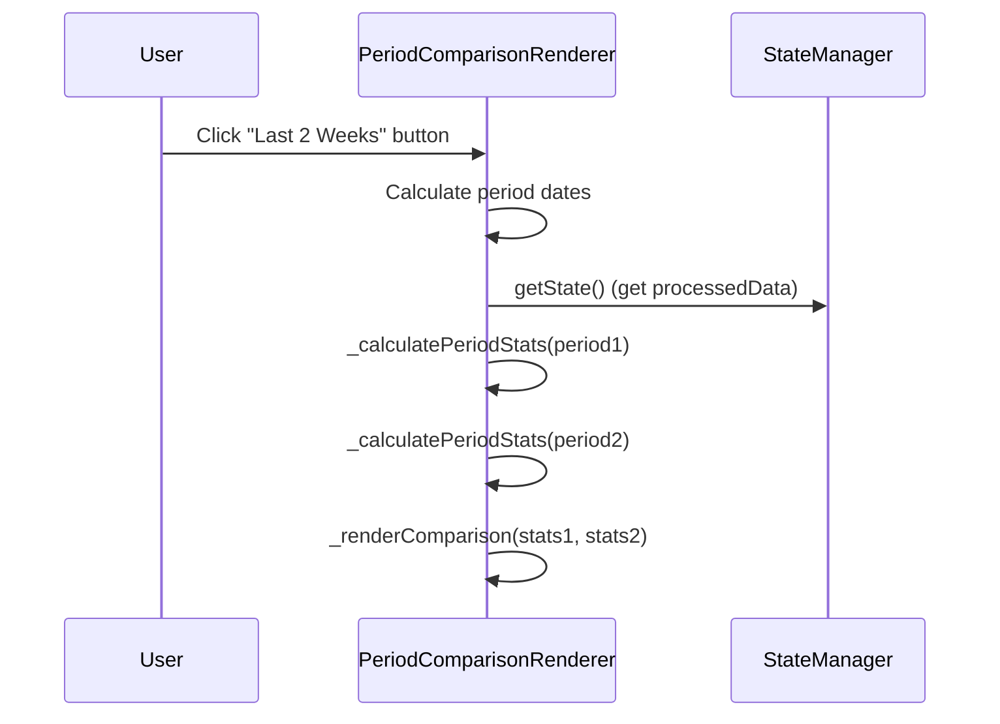

**Explanation:** Period comparison is handled entirely within the renderer, calculating derived stats on demand from existing processed data.

### 4.4 Goal Alerts Flow

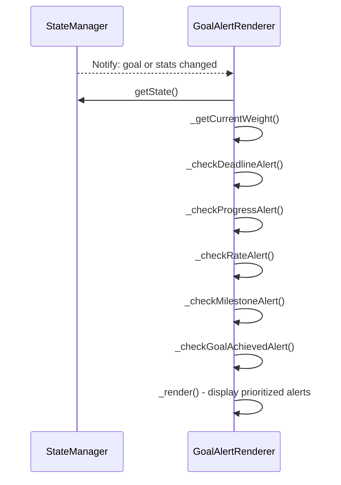

**Explanation:** Alert checking runs whenever goal or stats change, evaluating multiple conditions and displaying prioritized alerts.

### 4.5 Goal Suggestions Flow

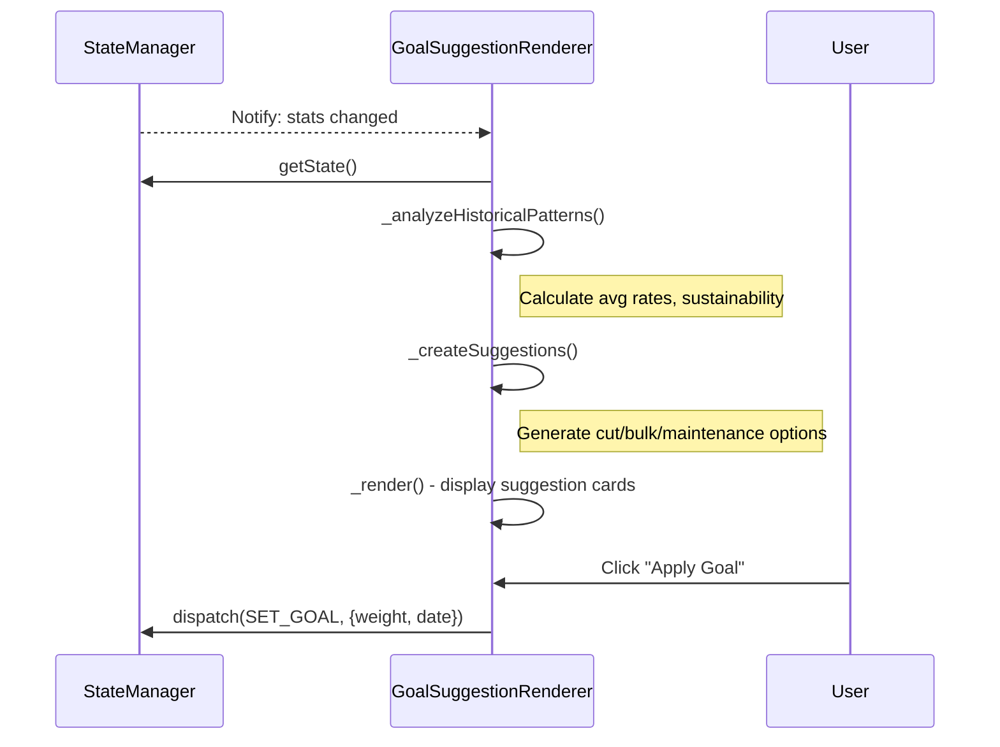

**Explanation:** Suggestions are generated from historical performance analysis. Users can apply suggestions directly, which dispatches to state.

### 4.6 Event Countdown Flow

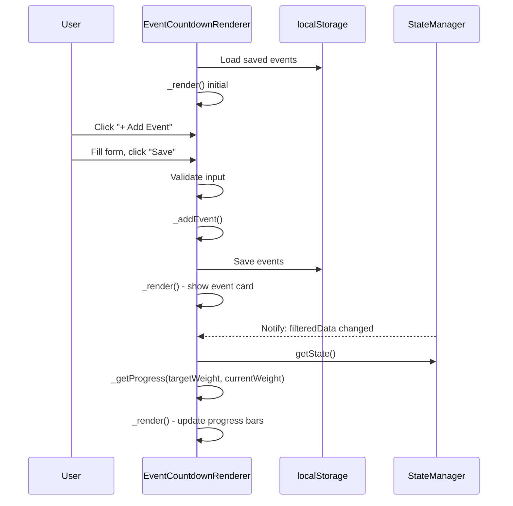

**Explanation:** Events are persisted in localStorage independently of main state. Progress bars update when weight data changes.

### 4.7 Advanced Insight Matrix Flow

```mermaid
sequenceDiagram
    participant StatsManager
    participant simple-statistics
    participant StateManager
    participant CorrelationMatrixRenderer

    StatsManager->>StatsManager: _calculateDerivedData()
    StatsManager->>StatsManager: _calculateCorrelationMatrix(filteredData)
    loop For each pair of variables
        StatsManager->>simple-statistics: sampleCorrelation(x, y)
    end
    StatsManager->>StateManager: dispatch(SET_DISPLAY_STATS, {correlationMatrix})
    StateManager-->>CorrelationMatrixRenderer: Notify: displayStatsUpdated
    CorrelationMatrixRenderer->>CorrelationMatrixRenderer: render(matrix)
    CorrelationMatrixRenderer->>CorrelationMatrixRenderer: _getColorForValue(val)
```

**Explanation:** The correlation matrix is computed during the main stats cycle using `simple-statistics`. The renderer uses a non-linear color scale to highlight strengths.

---

## 5. Premium Formulas

**Water Weight Prediction**
* `Water Weight (kg) = (Daily Carbs - Avg Carbs) * 3 / 1000 + (Daily Sodium - Avg Sodium) * 0.005`
* *Note: Simplified model assuming 3-4g water per 1g glycogen.*

**Adaptive TDEE (28-day Window)**
* `TDEE = (Total Intake + (Weight Start - Weight End) * 7700) / 28`
* Uses a longer smoothing window than the standard trend-based TDEE for higher stability.

**Calorie Accuracy Score**
* `Expected Change = (Intake - TDEE) / 7700`
* `Accuracy = 1 - (|Actual Change - Expected Change| / |Expected Change|)`

---

## 6. Architecture Overview

### Component Relationships

```mermaid
graph TB
    subgraph "Data Layer"
        DJ[data.json]
        DS[DataService]
        DJ --> DS
    end

    subgraph "State Layer"
        SM[StateManager]
        SEL[Selectors]
    end

    subgraph "Processing Layer"
        STATS[StatsManager]
        DOM[DomainManager]
    end

    subgraph "Rendering Layer"
        MU[MasterUpdater]
        CHART[ChartUpdaters]
        REND[Renderers]
    end

    DS --> SM
    SM --> STATS
    STATS --> SM
    SM --> SEL
    SEL --> MU
    SEL --> REND
    MU --> CHART
    DOM --> MU

    subgraph "Core Renderers"
        PR[Periodization]
        WCR[WorkoutCorrelation]
        PCR[PeriodComparison]
        GAR[GoalAlerts]
        GSR[GoalSuggestions]
        ECR[EventCountdown]
    end

    subgraph "Premium Renderers"
        CMR[CorrelationMatrix]
        TAR[TdeeAccuracy]
        CHR[CalorieHeatmap]
        STR[StreakTracker]
        WWR[WaterWeight]
        RDO[RateOptimizer]
        SC[SmartCoach]
    end

    SEL --> Core
    SEL --> Premium
```

---

*For technical details on each feature, see [features_reference.md](features_reference.md).*  
*For user documentation, see [user_guide.md](user_guide.md).*