# Application Flow Diagrams

This document contains diagrams illustrating the key flows within the Weight Insider application.

> **Related Documentation:**
> - [User Guide](user_guide.md) -- How to use all features
> - [Features Reference](features_reference.md) -- Technical details of all features
> - [Documentation Index](README.md) -- Overview of all documentation

## 1. Application Startup Flow

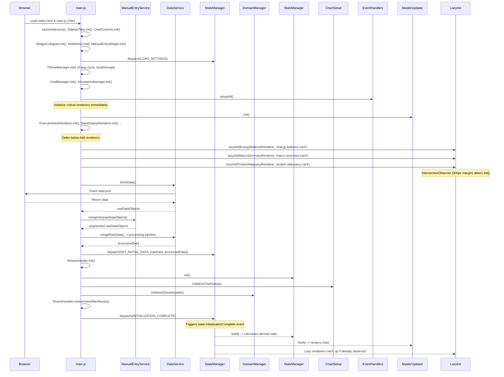
```mermaid
sequenceDiagram
    participant Browser
    participant main.js
    participant ManualEntryService
    participant DataService
    participant StateManager
    participant DomainManager
    participant StatsManager
    participant ChartSetup
    participant EventHandlers
    participant MasterUpdater
    participant LazyInit

    Browser->>main.js: Load index.html & main.js (Vite)
    main.js->>main.js: cacheSelectors(), SidebarTabs.init(), ChartControls.init()
    main.js->>main.js: WidgetCollapser.init(), MobileNav.init(), ManualEntryWidget.init()
    main.js->>StateManager: dispatch(LOAD_SETTINGS)
    main.js->>main.js: ThemeManager.init() (3-way cycle, localStorage)
    main.js->>main.js: GoalManager.init(), AnnotationManager.init()
    main.js->>EventHandlers: setupAll()

    Note over main.js: Initialize critical renderers immediately
    main.js->>MasterUpdater: init()
    main.js->>main.js: ExecutiveHubRenderer.init(), StatsDisplayRenderer.init(), ...

    Note over main.js: Defer below-fold renderers
    main.js->>LazyInit: lazyInit(EnergyBalanceRenderer, 'energy-balance-card')
    main.js->>LazyInit: lazyInit(MacroSummaryRenderer, 'macro-summary-card')
    main.js->>LazyInit: lazyInit(ProteinAdequacyRenderer, 'protein-adequacy-card')
    Note over LazyInit: IntersectionObserver (300px margin) defers init()

    main.js->>DataService: fetchData()
    DataService->>Browser: Fetch data.json
    Browser-->>DataService: Return data
    DataService-->>main.js: rawDataObjects
    main.js->>ManualEntryService: mergeInto(rawDataObjects)
    ManualEntryService-->>main.js: augmented rawDataObjects
    main.js->>DataService: mergeRawData() -> processing pipeline
    DataService-->>main.js: processedData

    main.js->>StateManager: dispatch(SET_INITIAL_DATA, {rawData, processedData})
    main.js->>main.js: ResizeHandler.init()
    main.js->>StatsManager: init()
    main.js->>ChartSetup: initializeChartSetup()
    main.js->>DomainManager: initializeDomains(state)
    main.js->>main.js: ResizeHandler.restoreViewAfterResize()
    main.js->>StateManager: dispatch(INITIALIZATION_COMPLETE)

    Note over StateManager: Triggers state:initializationComplete event
    StateManager-->>StatsManager: Notify -> calculates derived stats
    StateManager-->>MasterUpdater: Notify -> renders chart
    StateManager-->>LazyInit: Lazy renderers catch up if already observed
```

**Key changes from v3:**
1. `ManualEntryService.mergeInto()` overlays localStorage entries before processing.
2. `WidgetCollapser`, `MobileNav`, and `ManualEntryWidget` initialize before data fetch.
3. Below-fold renderers use `lazyInit()` with `IntersectionObserver` -- they include a catch-up block that checks `isInitialized` and renders immediately if they missed the init event.
4. Service Worker is registered after `initialize()` completes.

---

## 2. Event Handling Flows

### 2.1 Dot Hover/Click Interaction

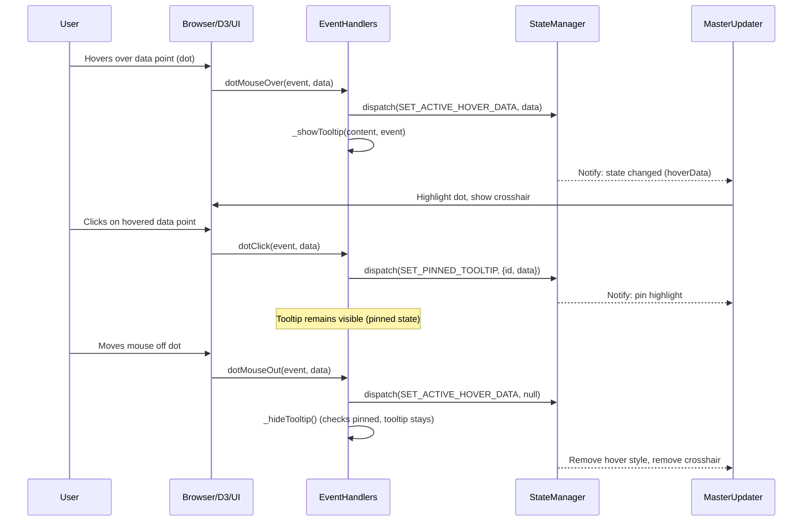
```mermaid
sequenceDiagram
    participant User
    participant Browser/D3/UI
    participant EventHandlers
    participant StateManager
    participant MasterUpdater

    User->>Browser/D3/UI: Hovers over data point (dot)
    Browser/D3/UI->>EventHandlers: dotMouseOver(event, data)
    EventHandlers->>StateManager: dispatch(SET_ACTIVE_HOVER_DATA, data)
    EventHandlers->>EventHandlers: _showTooltip(content, event)
    StateManager-->>MasterUpdater: Notify: state changed (hoverData)
    MasterUpdater->>Browser/D3/UI: Highlight dot, show crosshair

    User->>Browser/D3/UI: Clicks on hovered data point
    Browser/D3/UI->>EventHandlers: dotClick(event, data)
    EventHandlers->>StateManager: dispatch(SET_PINNED_TOOLTIP, {id, data})
    StateManager-->>MasterUpdater: Notify: pin highlight
    Note over EventHandlers: Tooltip remains visible (pinned state)

    User->>Browser/D3/UI: Moves mouse off dot
    Browser/D3/UI->>EventHandlers: dotMouseOut(event, data)
    EventHandlers->>StateManager: dispatch(SET_ACTIVE_HOVER_DATA, null)
    EventHandlers->>EventHandlers: _hideTooltip() (checks pinned, tooltip stays)
    StateManager-->>MasterUpdater: Remove hover style, remove crosshair
```

### 2.2 Date Range Input Change

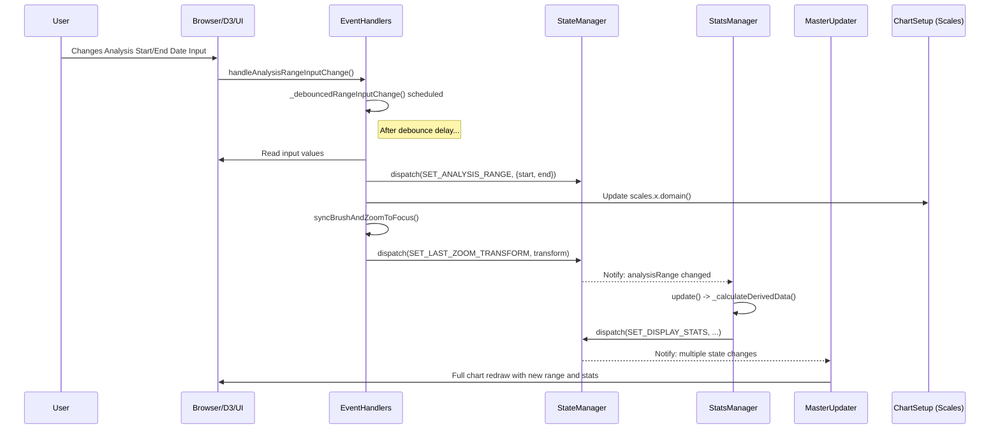
```mermaid
sequenceDiagram
    participant User
    participant Browser/D3/UI
    participant EventHandlers
    participant StateManager
    participant StatsManager
    participant MasterUpdater
    participant ChartSetup (Scales)

    User->>Browser/D3/UI: Changes Analysis Start/End Date Input
    Browser/D3/UI->>EventHandlers: handleAnalysisRangeInputChange()
    EventHandlers->>EventHandlers: _debouncedRangeInputChange() scheduled
    Note right of EventHandlers: After debounce delay...
    EventHandlers->>Browser/D3/UI: Read input values
    EventHandlers->>StateManager: dispatch(SET_ANALYSIS_RANGE, {start, end})
    EventHandlers->>ChartSetup (Scales): Update scales.x.domain()
    EventHandlers->>EventHandlers: syncBrushAndZoomToFocus()
    EventHandlers->>StateManager: dispatch(SET_LAST_ZOOM_TRANSFORM, transform)
    StateManager-->>StatsManager: Notify: analysisRange changed
    StatsManager->>StatsManager: update() -> _calculateDerivedData()
    StatsManager->>StateManager: dispatch(SET_DISPLAY_STATS, ...)
    StateManager-->>MasterUpdater: Notify: multiple state changes
    MasterUpdater->>Browser/D3/UI: Full chart redraw with new range and stats
```

### 2.3 Background Click

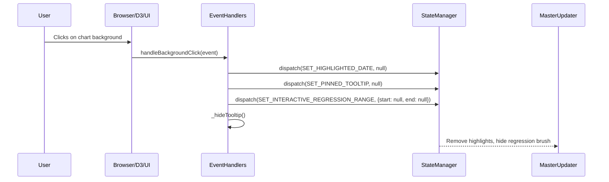
```mermaid
sequenceDiagram
    participant User
    participant Browser/D3/UI
    participant EventHandlers
    participant StateManager
    participant MasterUpdater

    User->>Browser/D3/UI: Clicks on chart background
    Browser/D3/UI->>EventHandlers: handleBackgroundClick(event)
    EventHandlers->>StateManager: dispatch(SET_HIGHLIGHTED_DATE, null)
    EventHandlers->>StateManager: dispatch(SET_PINNED_TOOLTIP, null)
    EventHandlers->>StateManager: dispatch(SET_INTERACTIVE_REGRESSION_RANGE, {start: null, end: null})
    EventHandlers->>EventHandlers: _hideTooltip()
    StateManager-->>MasterUpdater: Remove highlights, hide regression brush
```

### 2.4 Window Resize

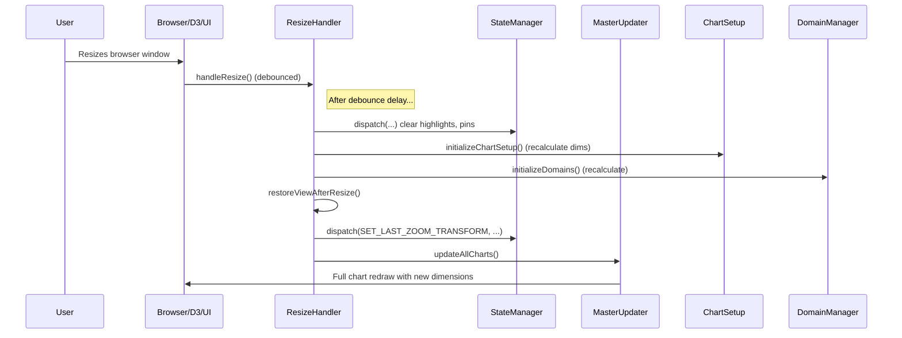
```mermaid
sequenceDiagram
    participant User
    participant Browser/D3/UI
    participant ResizeHandler
    participant StateManager
    participant MasterUpdater
    participant ChartSetup
    participant DomainManager

    User->>Browser/D3/UI: Resizes browser window
    Browser/D3/UI->>ResizeHandler: handleResize() (debounced)
    Note right of ResizeHandler: After debounce delay...
    ResizeHandler->>StateManager: dispatch(...) clear highlights, pins
    ResizeHandler->>ChartSetup: initializeChartSetup() (recalculate dims)
    ResizeHandler->>DomainManager: initializeDomains() (recalculate)
    ResizeHandler->>ResizeHandler: restoreViewAfterResize()
    ResizeHandler->>StateManager: dispatch(SET_LAST_ZOOM_TRANSFORM, ...)
    ResizeHandler->>MasterUpdater: updateAllCharts()
    MasterUpdater->>Browser/D3/UI: Full chart redraw with new dimensions
```

### 2.5 Goal Form Submission

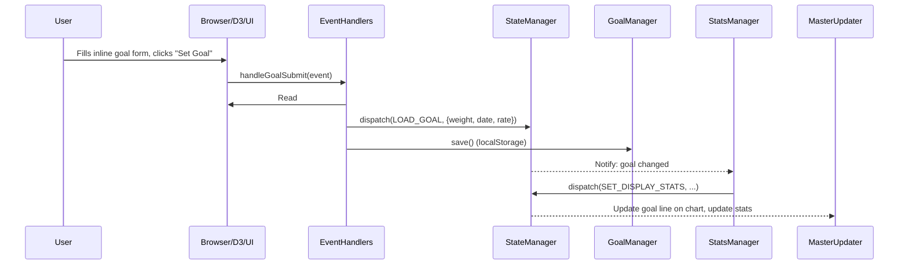
```mermaid
sequenceDiagram
    participant User
    participant Browser/D3/UI
    participant EventHandlers
    participant StateManager
    participant GoalManager
    participant StatsManager
    participant MasterUpdater

    User->>Browser/D3/UI: Fills inline goal form, clicks "Set Goal"
    Browser/D3/UI->>EventHandlers: handleGoalSubmit(event)
    EventHandlers->>Browser/D3/UI: Read #goalWeight, #goalDate, #goalTargetRate
    EventHandlers->>StateManager: dispatch(LOAD_GOAL, {weight, date, rate})
    EventHandlers->>GoalManager: save() (localStorage)
    StateManager-->>StatsManager: Notify: goal changed
    StatsManager->>StateManager: dispatch(SET_DISPLAY_STATS, ...)
    StateManager-->>MasterUpdater: Update goal line on chart, update stats
```

### 2.6 Theme Toggle (3-Way Cycle)

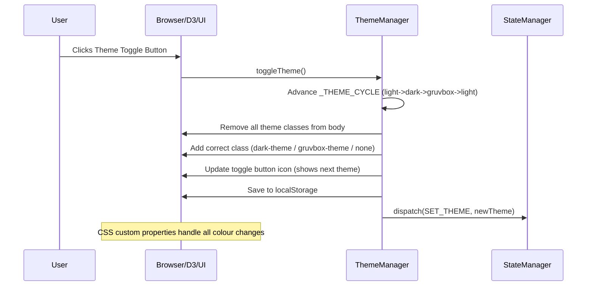
```mermaid
sequenceDiagram
    participant User
    participant Browser/D3/UI
    participant ThemeManager
    participant StateManager

    User->>Browser/D3/UI: Clicks Theme Toggle Button
    Browser/D3/UI->>ThemeManager: toggleTheme()
    ThemeManager->>ThemeManager: Advance _THEME_CYCLE (light->dark->gruvbox->light)
    ThemeManager->>Browser/D3/UI: Remove all theme classes from body
    ThemeManager->>Browser/D3/UI: Add correct class (dark-theme / gruvbox-theme / none)
    ThemeManager->>Browser/D3/UI: Update toggle button icon (shows next theme)
    ThemeManager->>Browser/D3/UI: Save to localStorage
    ThemeManager->>StateManager: dispatch(SET_THEME, newTheme)
    Note over Browser/D3/UI: CSS custom properties handle all colour changes
```

### 2.7 Annotation Form Submission

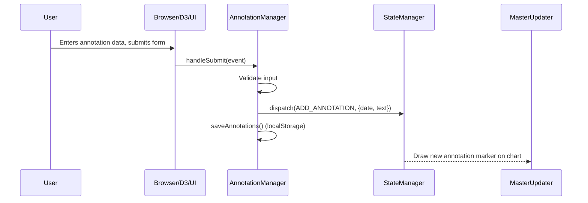
```mermaid
sequenceDiagram
    participant User
    participant Browser/D3/UI
    participant AnnotationManager
    participant StateManager
    participant MasterUpdater

    User->>Browser/D3/UI: Enters annotation data, submits form
    Browser/D3/UI->>AnnotationManager: handleSubmit(event)
    AnnotationManager->>AnnotationManager: Validate input
    AnnotationManager->>StateManager: dispatch(ADD_ANNOTATION, {date, text})
    AnnotationManager->>AnnotationManager: saveAnnotations() (localStorage)
    StateManager-->>MasterUpdater: Draw new annotation marker on chart
```

### 2.8 Manual Trendline Input Change

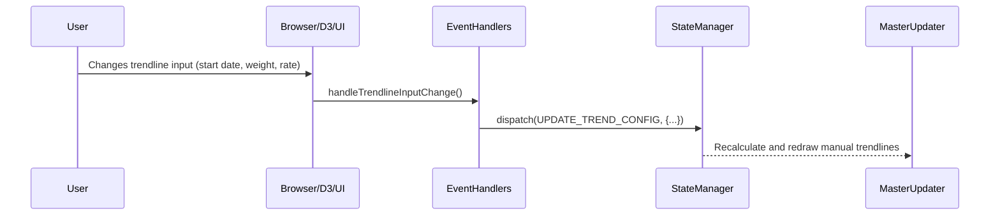
```mermaid
sequenceDiagram
    participant User
    participant Browser/D3/UI
    participant EventHandlers
    participant StateManager
    participant MasterUpdater

    User->>Browser/D3/UI: Changes trendline input (start date, weight, rate)
    Browser/D3/UI->>EventHandlers: handleTrendlineInputChange()
    EventHandlers->>StateManager: dispatch(UPDATE_TREND_CONFIG, {...})
    StateManager-->>MasterUpdater: Recalculate and redraw manual trendlines
```

### 2.9 Manual Entry (Quick Entry Widget)

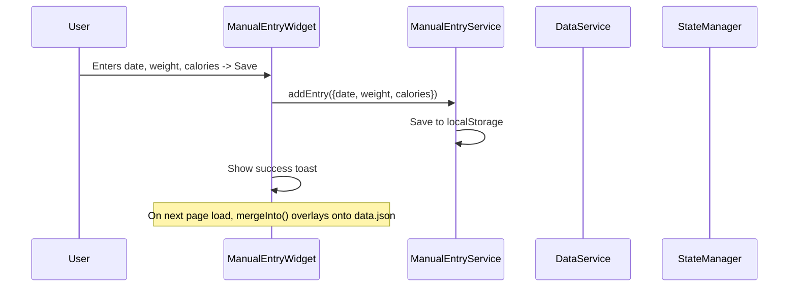
```mermaid
sequenceDiagram
    participant User
    participant ManualEntryWidget
    participant ManualEntryService
    participant DataService
    participant StateManager

    User->>ManualEntryWidget: Enters date, weight, calories -> Save
    ManualEntryWidget->>ManualEntryService: addEntry({date, weight, calories})
    ManualEntryService->>ManualEntryService: Save to localStorage
    ManualEntryWidget->>ManualEntryWidget: Show success toast
    Note over ManualEntryWidget: On next page load, mergeInto() overlays onto data.json
```

### 2.10 Widget Collapse/Expand

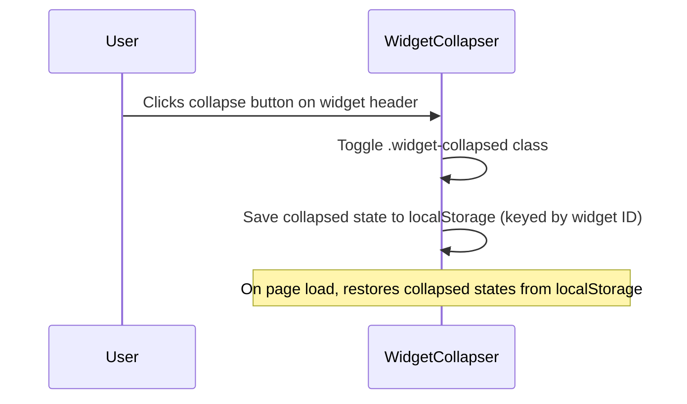
```mermaid
sequenceDiagram
    participant User
    participant WidgetCollapser

    User->>WidgetCollapser: Clicks collapse button on widget header
    WidgetCollapser->>WidgetCollapser: Toggle .widget-collapsed class
    WidgetCollapser->>WidgetCollapser: Save collapsed state to localStorage (keyed by widget ID)
    Note over WidgetCollapser: On page load, restores collapsed states from localStorage
```

---

## 3. Data Processing Pipeline

### 3.1 Full Processing Chain

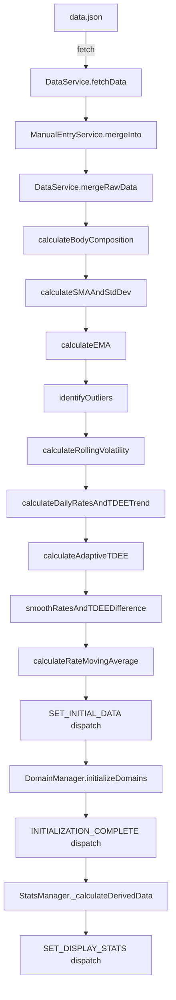
```mermaid
graph TD
    A[data.json] -->|fetch| B[DataService.fetchData]
    B --> C[ManualEntryService.mergeInto]
    C --> D[DataService.mergeRawData]
    D --> E[calculateBodyComposition]
    E --> F[calculateSMAAndStdDev]
    F --> G[calculateEMA]
    G --> H[identifyOutliers]
    H --> I[calculateRollingVolatility]
    I --> J[calculateDailyRatesAndTDEETrend]
    J --> K[calculateAdaptiveTDEE]
    K --> L[smoothRatesAndTDEEDifference]
    L --> M[calculateRateMovingAverage]
    M --> N[SET_INITIAL_DATA dispatch]
    N --> O[DomainManager.initializeDomains]
    O --> P[INITIALIZATION_COMPLETE dispatch]
    P --> Q[StatsManager._calculateDerivedData]
    Q --> R[SET_DISPLAY_STATS dispatch]
```

### 3.2 Macro Data Flow

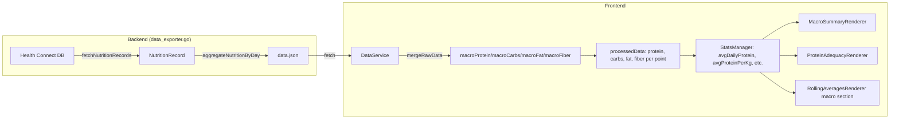
```mermaid
graph LR
    subgraph "Backend (data_exporter.go)"
        HC[Health Connect DB] -->|fetchNutritionRecords| NR[NutritionRecord]
        NR -->|aggregateNutritionByDay| DJ[data.json]
    end
    subgraph "Frontend"
        DJ -->|fetch| DS[DataService]
        DS -->|mergeRawData| MP[macroProtein/macroCarbs/macroFat/macroFiber]
        MP --> PD[processedData: protein, carbs, fat, fiber per point]
        PD --> SM[StatsManager: avgDailyProtein, avgProteinPerKg, etc.]
        SM --> MSR[MacroSummaryRenderer]
        SM --> PAR[ProteinAdequacyRenderer]
        SM --> RAR[RollingAveragesRenderer macro section]
    end
```

---

## 4. Lazy Initialization Flow

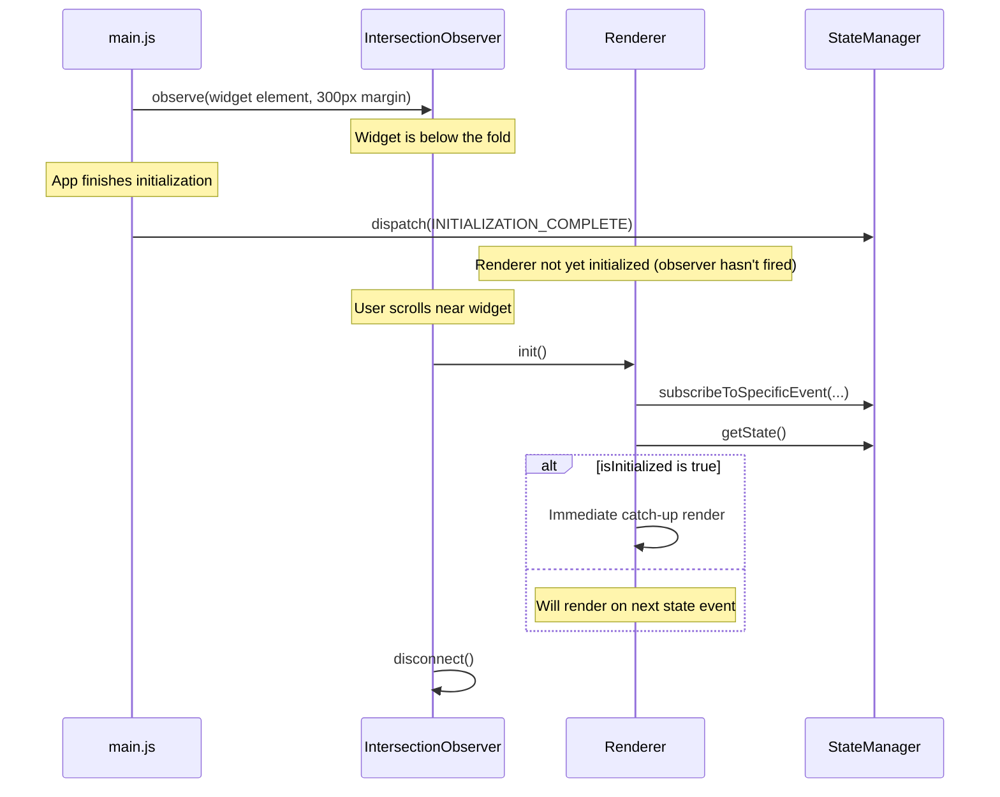
```mermaid
sequenceDiagram
    participant main.js
    participant IntersectionObserver
    participant Renderer
    participant StateManager

    main.js->>IntersectionObserver: observe(widget element, 300px margin)
    Note over IntersectionObserver: Widget is below the fold

    Note over main.js: App finishes initialization
    main.js->>StateManager: dispatch(INITIALIZATION_COMPLETE)
    Note over Renderer: Renderer not yet initialized (observer hasn't fired)

    Note over IntersectionObserver: User scrolls near widget
    IntersectionObserver->>Renderer: init()
    Renderer->>StateManager: subscribeToSpecificEvent(...)
    Renderer->>StateManager: getState()
    alt isInitialized is true
        Renderer->>Renderer: Immediate catch-up render
    else
        Note over Renderer: Will render on next state event
    end
    IntersectionObserver->>IntersectionObserver: disconnect()
```

The catch-up pattern prevents lazy renderers from staying blank after they missed the `INITIALIZATION_COMPLETE` event:

```javascript
init() {
    StateManager.subscribeToSpecificEvent("state:filteredDataChanged", () => this._render());
    StateManager.subscribeToSpecificEvent("state:initializationComplete", () => this._render());

    const s = StateManager.getState();
    if (s.isInitialized) this._render();
}
```

---

## 5. Key Formulas and Calculations

**TDEE Estimation (from Weight Trend)**
- `Daily KG Change = Weekly KG Change / 7`
- `Daily Deficit/Surplus (kcal) = Daily KG Change * KCALS_PER_KG`
- `TDEE (kcal) = Average Calorie Intake - Daily Deficit/Surplus`

**Estimated Deficit/Surplus (from Trend)**
- `Daily KG Change = Weekly KG Change / 7`
- `Estimated Daily Deficit/Surplus (kcal) = Daily KG Change * KCALS_PER_KG`

**Time to Goal Projection**
- `Weight Difference (kg) = Goal Weight - Current Weight`
- `Weeks Needed = Weight Difference / Weekly KG Change`

**Required Rate for Goal Date**
- `Weight Difference (kg) = Goal Weight - Current Weight`
- `Days Remaining = (Goal Date - Today) / ms_per_day`
- `Required Weekly Rate (kg/wk) = Weight Difference / (Days Remaining / 7)`

**Required Calorie Adjustment**
- `Rate Difference (kg/wk) = Target Rate - Current Trend Rate`
- `Required Daily Adjustment (kcal) = (Rate Difference / 7) * KCALS_PER_KG`

**Linear Regression**
- Uses `simple-statistics.linearRegression()` on weight (or SMA) data over the selected regression range.
- Slope = average daily weight change (kg/day).

**Volatility**
- Standard deviation of (raw weight - SMA) within the analysis range.

**Plateau Detection**
- `smoothedWeeklyRate` within `CONFIG.plateauRateThresholdKgWeek` for `CONFIG.plateauMinDurationWeeks`.

**Water Weight Prediction**
- `Water Weight (kg) = (Daily Carbs - Avg Carbs) * 3 / 1000`

**Adaptive TDEE (28-day Window)**
- `TDEE = (Total Intake + (Weight Start - Weight End) * 7700) / 28`

**Calorie Accuracy Score**
- `Expected Change = (Intake - TDEE) / 7700`
- `Accuracy = 1 - (|Actual Change - Expected Change| / |Expected Change|)`

**Protein Adequacy**
- `g_per_kg = latestProtein / currentWeight`
- Optimal >= 1.6, Sufficient >= 1.2, Low < 1.2

---

## 6. Architecture Overview

### Component Relationships


```mermaid
graph TB
    subgraph "Data Layer"
        DJ[data.json]
        MES[ManualEntryService]
        DS[DataService]
        DJ --> DS
        MES --> DS
    end

    subgraph "State Layer"
        SM[StateManager]
        SEL[Selectors]
    end

    subgraph "Processing Layer"
        STATS[StatsManager]
        DOM[DomainManager]
    end

    subgraph "Rendering Layer"
        MU[MasterUpdater]
        CHART[ChartUpdaters]
        WC[WidgetCollapser]
        MN[MobileNav]
    end

    DS --> SM
    SM --> STATS
    STATS --> SM
    SM --> SEL
    SEL --> MU
    MU --> CHART
    DOM --> MU

    subgraph "Immediate Renderers"
        EH[ExecutiveHub]
        SD[StatsDisplay]
        GA[GoalAlerts]
        GS[GoalSuggestions]
        GI[GoalSimulator]
        SC[SmartCoach]
        VS[VitalStatsEnricher]
    end

    subgraph "Lazy Renderers (IntersectionObserver)"
        EB[EnergyBalance]
        ES[EnergySankey]
        MS[MacroSummary]
        PA[ProteinAdequacy]
        WR[WeeklyReview]
        CH[CalorieHeatmap]
        CM[CorrelationMatrix]
    end

    subgraph "Sidebar Renderers"
        PR[Periodization]
        PC[PeriodComparison]
        WA[WeekendAnalysis]
        RA[RollingAverages]
        MR[MonthlyReport]
        PB[PlateauBreaker]
        WW[WhatWorked]
    end

    SEL --> EH & SD & GA & GS & GI & SC & VS
    SEL --> EB & ES & MS & PA & WR & CH & CM
    SEL --> PR & PC & WA & RA & MR & PB & WW
```

### Theme Architecture

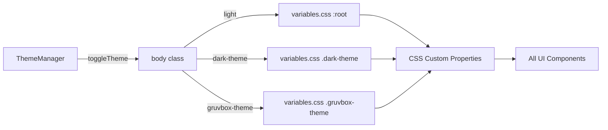
```mermaid
graph LR
    TM[ThemeManager] -->|toggleTheme| BODY[body class]
    BODY -->|light| LV[variables.css :root]
    BODY -->|dark-theme| DV[variables.css .dark-theme]
    BODY -->|gruvbox-theme| GV[variables.css .gruvbox-theme]
    LV & DV & GV --> CP[CSS Custom Properties]
    CP --> ALL[All UI Components]
```

### PWA Architecture

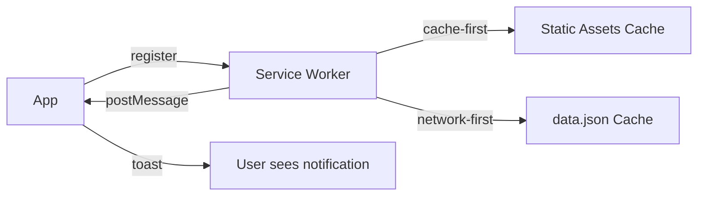
```mermaid
graph LR
    APP[App] -->|register| SW[Service Worker]
    SW -->|cache-first| STATIC[Static Assets Cache]
    SW -->|network-first| DATA[data.json Cache]
    SW -->|postMessage| APP
    APP -->|toast| USER[User sees notification]
```

---

## 7. Backend Data Export Flow

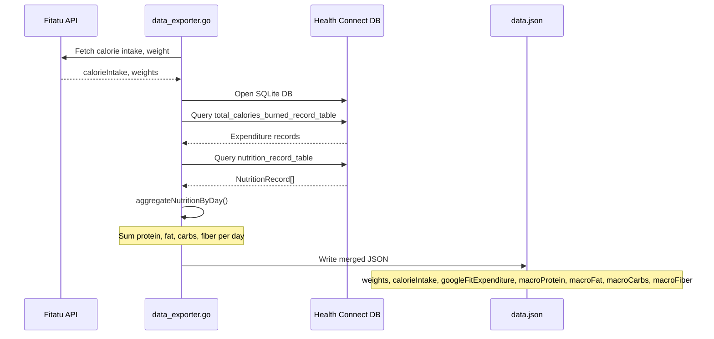
```mermaid
sequenceDiagram
    participant Fitatu API
    participant data_exporter.go
    participant Health Connect DB
    participant data.json

    data_exporter.go->>Fitatu API: Fetch calorie intake, weight
    Fitatu API-->>data_exporter.go: calorieIntake, weights

    data_exporter.go->>Health Connect DB: Open SQLite DB
    data_exporter.go->>Health Connect DB: Query total_calories_burned_record_table
    Health Connect DB-->>data_exporter.go: Expenditure records
    data_exporter.go->>Health Connect DB: Query nutrition_record_table
    Health Connect DB-->>data_exporter.go: NutritionRecord[]
    data_exporter.go->>data_exporter.go: aggregateNutritionByDay()
    Note over data_exporter.go: Sum protein, fat, carbs, fiber per day

    data_exporter.go->>data.json: Write merged JSON
    Note over data.json: weights, calorieIntake, googleFitExpenditure, macroProtein, macroFat, macroCarbs, macroFiber
```

### Health Connect NutritionRecord Schema

```sql
nutrition_record_table (
    row_id              INTEGER PRIMARY KEY,
    app_info_id         INTEGER,
    protein             REAL,
    total_fat           REAL,
    total_carbohydrate  REAL,
    dietary_fiber       REAL,
    local_date_time_start_time INTEGER,  -- Unix epoch millis
    ...
)
```

---

*For technical details on each feature, see [features_reference.md](features_reference.md).*
*For user documentation, see [user_guide.md](user_guide.md).*
